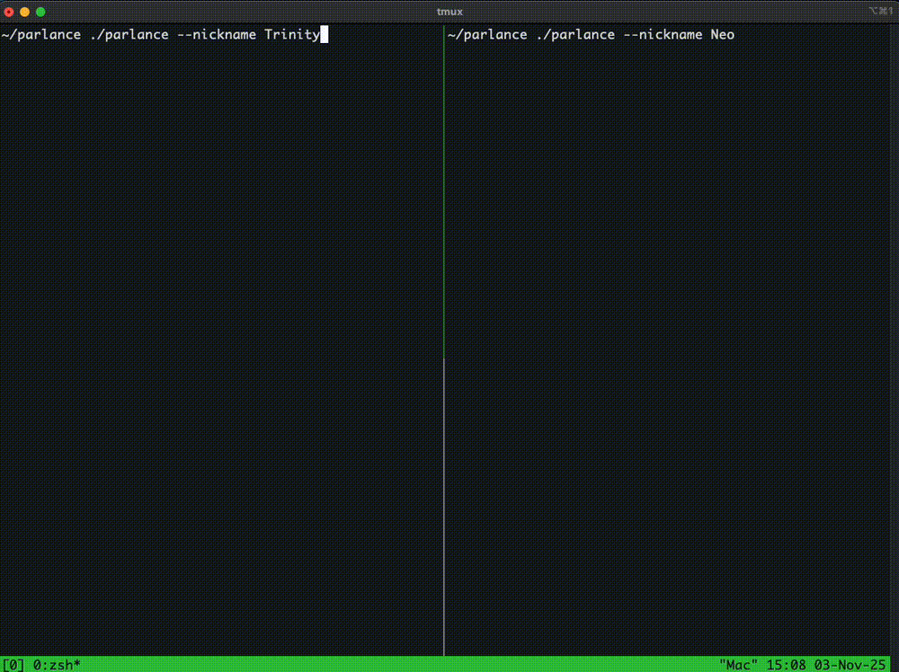

# Parlance

A decentralized messaging application for local area networks. Uses UDP multicast for automatic peer discovery and TCP for direct peer-to-peer communication.

## Demo


## Overview
A functional P2P messaging application for LANs. We demonstrate how peers can discover each other and exchange messages without any central coordination. All communication happens directly between clients.

## Current State

**Working:**
- UDP multicast-based peer discovery (IPv4 only)
- Direct TCP messaging between discovered peers
- Multiple instances on the same machine (SO_REUSEPORT)

**Limitations:**
- Local network only (no NAT traversal)
- No encryption (cleartext over TCP)
- No message persistence
- No group chat (only 1-to-1 messaging)

## Architecture

**Discovery Layer (UDP Multicast):**
- Multicast group: `239.255.255.250:6789`
- Periodic announcements every 5 seconds
- Peer timeout after 15 seconds of silence
- JSON-serialized discovery messages

**Messaging Layer (TCP):**
- Each peer listens on a dynamically assigned port
- Direct socket connections for message delivery
- Line-delimited JSON over TCP
- Concurrent connection handling via Tokio

## Building

Requires Rust 1.70 or later.

```bash
cargo build --release
```

## Usage

Start multiple instances on the same network:

```bash
# Terminal 1
cargo run -- --nickname alice

# Terminal 2
cargo run -- --nickname bob
```

Discovery happens automatically. After a few seconds, peers will appear in each other's peer lists.

**Commands:**
- `/peers` - Show discovered peers
- `/send <nickname> <message>` - Send a message
- `/quit` - Exit

**Example:**
```
/peers
/send bob hey, testing this out
```

Messages appear in the recipient's terminal with a timestamp.

## Protocol Details

### Discovery Protocol

Peers send periodic announcements to `239.255.255.250:6789`:

```json
{
  "type": "announce",
  "nickname": "alice",
  "tcp_port": 54321
}
```

The peer registry maintains a list of all recently-seen peers. Peers are removed if they haven't announced in 15 seconds.

### Messaging Protocol

Messages are sent over TCP as line-delimited JSON:

```json
{
  "from": "alice",
  "content": "message text",
  "timestamp": 1699123456
}
```

Each peer maintains a TCP listener. To send a message, a peer:
1. Looks up the recipient in the peer registry
2. Opens a TCP connection to their address
3. Sends the JSON message followed by `\n`
4. Closes the connection

This is inefficient but simple.